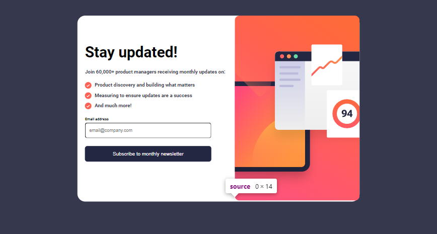
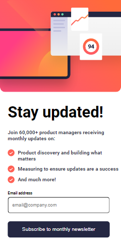

# Frontend Mentor - Newsletter sign-up form with success message solution

This is a solution to the [Newsletter sign-up form with success message challenge on Frontend Mentor](https://www.frontendmentor.io/challenges/newsletter-signup-form-with-success-message-3FC1AZbNrv). 

## Table of contents

  - [The challenge](#the-challenge)
  - [Screenshot](#screenshot)
  - [Built with](#built-with)
  - [Author](#author)

## The challenge

Users should be able to:

- Add their email and submit the form
- See a success message with their email after successfully submitting the form
- See form validation messages if:
  - The field is left empty
  - The email address is not formatted correctly
- View the optimal layout for the interface depending on their device's screen size
- See hover and focus states for all interactive elements on the page

## Screenshot

#### desktop_view

#### mobile_view

## Links

- Solution URL: [ newsletter-sign_up](https://github.com/Ezekiel-Great/newsletter-sign-up_main)
- Live Site URL: [newsletter-sign_up Live site URL](https://your-live-site-url.com)

## Built with

- Semantic HTML5 markup
- CSS custom properties
- Flexbox
- CSS Grid

## Author

- Frontend Mentor - [@Ezekiel-Great](https://www.frontendmentor.io/profile/Ezekiel-Great)
- Twitter - [@yeshua_codeit](https://www.twitter.com/yeshua_codeit )

